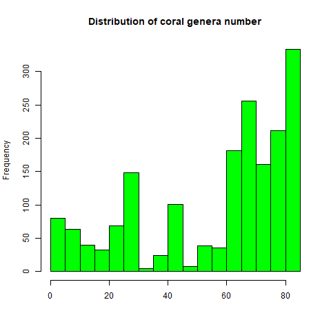

# test_compendium

The goal of test_compendium is to present a standard way to organize

a computational research project.

## Example outputs

In this compendium, we have plotted the distribution of the number of coral genera for the world coral reef:

|                             |
|:---------------------------:|
|  |

## Installation

You can install the development version of ***test_compendium*** from [GitHub](https://github.com/) with:

``` r
# install.packages("devtools")
devtools::install_github("CamaraTinah/test_compendium")
```

## Example

This is a basic example which shows you how to solve a common problem:

``` r
library(test_compendium)
## basic example code
```
